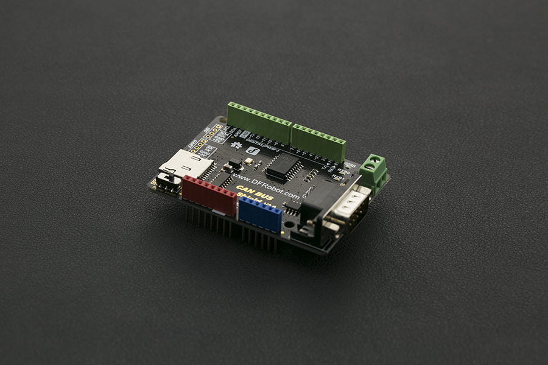

# DFRobot_CANBUS
- [中文版](./README_CN.md)

This is an Arduino Can Bus shield.  It is compatible with the Arduino standard interface and can be stacked on an Arduino UNO,<br>
Leonardo or MEGA board.<br>
The shield integrates an MCP2515 CANBUS chip on the shield and has a CAN-BUS transceiver function. With an on-board DB9 <br>
and CAN-BUS connector you can choose a suitable port according to your host device.<br>

There is also an integrated MicroSD socket for data storage - a perfect solution for data logging applications.<br>

What is Canbus?  Controller Area Network (CAN bus) is a vehicle bus standard designed to allow microcontrollers and devices to <br>
communicate with each other in applications without a host computer. It is a message-based protocol, designed originally for <br>
multiplex electrical wiring within automobiles, but is also used in many other contexts.



## Product Link（https://www.dfrobot.com/product-1444.html)    
   DFR0370：CAN BUS Shield for Arduino
## Table of Contents

* [Summary](#summary)
* [Installation](#installation)
* [Methods](#methods)
* [Compatibility](#compatibility)
* [History](#history)
* [Credits](#credits)

## Summary
Provide an Arduino library supports the CAN-BUS BUS expansion board
## Installation

To use this library, first download the library file, paste it into the \Arduino\libraries directory, then open the examples folder and run the demo in the folder.


## Methods
```C++

  /*!
   * @fn DFRobot_CANBUS
   * @brief Constructor, specify the CAN-BUS Shield V1.0 SPI chip select pin.
   * @param _CS  Chip select
   */
  DFRobot_CANBUS(uint8_t _CS);
  
  /*!
   * @fn init
   * @brief Initialize SPI module; reset MCP2515. Parameter
   * @return None
   */
  void  init(void);

  /*!
   * @fn begin
   * @brief Initialize setting CAN-BUS buadrate, follow the init() function.
   * @param speedset  Baudrate: CAN_5KBPS, CAN_10KBPS, CAN_20KBPS, CAN_31K25BPS, 
   * @n CAN_33KBPS, CAN_40KBPS, CAN_50KBPS, CAN_80KBPS, CAN_83K3BPS, CAN_95KBPS, 
   * @n CAN_100KBPS, CAN_125KBPS, CAN_200KBPS, CAN_250KBPS, CAN_500KBPS, CAN_1000KBPS.
   * @return If the initialization is successful, return "CAN_OK"; if initialization fails, return "CAN_FAILINIT".
   */
  uint8_t begin(uint8_t speedset);    
  
  /*!
   * @fn sendMsgBuf
   * @brief Send a set of data frame.
   * @param id Data frame ID
   * @param ext "ext = 0", it is a standard frame; "ext = 1", it is an extended frame.
   * @param len data length, len < 8
   * @param buf  Data buffer point
   * @return If success, returns "CAN_OK"; if timeout, returns "CAN_SENDMSGTIMEOUT"; If you fail to get the next free buffer, it returns "CAN_GETTXBFTIMEOUT".
   */
  uint8_t sendMsgBuf(uint32_t id, uint8_t ext, uint8_t len, uint8_t *buf);   

  /*!
   * @fn isRemoteRequest
   * @brief Check whether it is a remote frame
   * @return "1", Yes; "0", No
   */
  uint8_t isRemoteRequest(void);
  
  /*!
   * @fn initMask
   * @brief Initialize the mask register
   * @param Masker_num mask register name: MCP_RXM0、MCP_RXM1; If Masker_num = MCP_RXM0,
   * @n initialize the mask register 0 (mask register 0 receives data from buffer0); if Masker_num = MCP_RXM1,
   * @n initialize the mask register 1 (mask register 1 receives data from buffer1).
   * @param ext configure standard frame with mask register setting; "ext = 1", configure extended frame with mask register setting.
   * @param Data Write this data into mask register, to configure which register will be blocked.
   * @return if success, returns "MCP_OK"; if fail, returns "MCP_FAIL"
   */
  uint8_t initMask(eMasker_t Masker_num, uint8_t ext, uint32_t Data);
  
  /*!
   * @fn checkReceive
   * @brief check the validity of received data frame.
   * @return If the shield receives the valid data frame, return "CAN_MSGAVAIL"; if no, return "CAN_NOMSG";
   */
  uint8_t checkReceive(void);

  /*!
   * @fn initFilter
   * @brief  Initialize the message acceptance filter register.
   * @param filterNum Message acceptance filter number, could be MCP_RXF0, MCP_RXF1, MCP_RXF2, MCP_RXF3, MCP_RXF4, MCP_RXF5.
   * @param ext if "ext=0", it means the message acceptance filter receive standard data frame message only; 
   * @n     if "ext=1", it means the message acceptance filter receive extended data frame message only.
   * @param data Filtered message ID. Only the data frame with filtered id can be received by CAN controller. 
   * @n     So an upcoming data frame whether can be received depends the value in MCP_RXM0/MCP_RXM1 in 
   * @n     init_Mask() function, the value in MCP_RXF0 registers in init_Filter() function and upcoming message identifier
   * @n     ID. These three values can be looked up on the Table below. If every true result is received, then the message
   * @n     will be received by the CAN controller. Otherwise, it will be discarded.
   * @return "CAN_OK" means reading successfully; Contrarily, return "MCP_FA".
   */
  uint8_t initFilter(eFilter_t filterNum, uint8_t ext, uint32_t data);
  
  /*!
   * @fn sendMsgBuf
   * @brief Send remote sending request message..
   * @param id   Data frame ID
   * @param ext "ext = 0", it is a standard frame; "ext = 1", it is an extended frame.
   * @param rtr data length, len < 8
   * @param len "rtr = 1", it is a Remote sending request frame; "rtr = 0", it is a data frame.
   * @param buf   Data buffer point
   * @return If success, returns "CAN_OK"; if timeout, returns "CAN_SENDMSGTIMEOUT"; If you fail to get the next free buffer, it returns "CAN_GETTXBFTIMEOUT".
   */
  uint8_t sendMsgBuf(uint32_t id, uint8_t ext, uint8_t rtr, uint8_t len, uint8_t *buf);  

  /*!
   * @fn readMsgBuf
   * @brief Read data from MCP2515 receiving buffer.
   * @param len   Save the receiving data length
   * @param buf  Save the receiving data
   * @return  "CAN_OK" means reading successfully; Contrarily, return "CAN_NOMSG".
   */
  uint8_t readMsgBuf(uint8_t *len, uint8_t *buf);
  
  /*!
   * @fn readMsgBufID
   * @brief read data from MCP2515 receiving buffer and read this data frame ID.
   * @param ID  Save the data frame ID
   * @param len   Save the receiving data length
   * @param buf  Save the receiving data
   * @return  "CAN_OK" means reading successfully; Contrarily, return "CAN_NOMSG".
   */
  uint8_t readMsgBufID(uint32_t *ID, uint8_t *len, uint8_t *buf);
  
  /*!
   * @fn checkError
   * @brief MCP2515 control error inquiry
   * @return "CAN_CTRLERROR" means it sends the control error; Contrarily, return "CAN_OK".
   */
  uint8_t checkError(void);

  /*!
   * @fn getCanId
   * @brief  Get the current data frame's ID
   * @return Data frame ID
   */
  uint32_t getCanId(void);
  
  /*!
   * @fn isExtendedFrame
   * @brief Check whether it is a extended frame.
   * @return  "1", Yes; "0", No
   */
  uint8_t isExtendedFrame(void);
```

## Compatibility

MCU                | Work Well    | Work Wrong   | Untested    | Remarks
------------------ | :----------: | :----------: | :---------: | -----
Arduino Uno        |      √       |              |             | 
Arduino Leonardo|      √       |              |             | 


## History

- 2022/09/03 - Version 1.0.0 released.
## Credits

Written by fengli(li.feng@dfrobot.com), 2022.09.03 (Welcome to our [website](https://www.dfrobot.com/))


