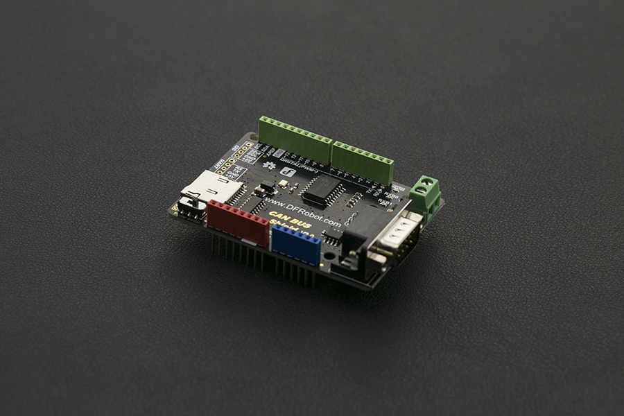

# DFRobot_CANBUS
- [English Version](./README.md)

CAN-BUS Shield V2.0是专为Arduino控制器设计的扩展板，板载MCP2515总线控制芯片能够实现CAN总线上的数据控制，实<br>
现设备与设备之间的数据通信。扩展板兼容Arduino标准卡槽，可以完美适配于Arduino UNO，Leonardo等主控板。并且提<br>
供一个DB9和一个接线柱形式的接口，您可以根据需要自主选择接口。内嵌MicroSD卡槽，可直插MicroSD卡，存储数据。<br>
多种扩展接口使得用户在DIY过程中得到更大的便利。<br>



## 产品链接（https://www.dfrobot.com.cn/goods-1264.html)
    DFR0370：CAN-BUS 总线扩展板 V2.0
## 目录

  * [概述](#概述)
  * [库安装](#库安装)
  * [方法](#方法)
  * [兼容性](#兼容性)
  * [历史](#历史)
  * [创作者](#创作者)

## 概述

提供arduino库支持CAN-BUS 总线扩展板

## 库安装

使用此库前，请首先下载库文件，将其粘贴到\Arduino\libraries目录中，然后打开examples文件夹并在该文件夹中运行演示。

## 方法
```C++

  /*!
   * @fn DFRobot_CANBUS
   * @brief 构造函数 指定CAN-BUS Shield V1.0模块的CAN接口SPI的片选信号引脚
   * @param _CS 端口编号
   */
  DFRobot_CANBUS(uint8_t _CS);
  
  /*!
   * @fn init
   * @brief 初始化spi模块，以及对MCP2515进行软件复位
   */
  void  init(void);

  /*!
   * @fn begin
   * @brief  初始化设置CAN的波特率，在init()后面使用
   * @param speedset  波特率，可以是：CAN_5KBPS、CAN_10KBPS、CAN_20KBPS、CAN_31K25BPS、
   * @n CAN_33KBPS、CAN_40KBPS、CAN_50KBPS、CAN_80KBPS、CAN_83K3BPS、CAN_95KBPS、CAN_100KBPS、
   * @n CAN_125KBPS、CAN_200KBPS、CAN_250KBPS、CAN_500KBPS、CAN_1000KBPS。
   * @return 如果初始化成功返回CAN_OK，如果初始化失败返回CAN_FAILINIT
   */
  uint8_t begin(uint8_t speedset);    
  
  /*!
   * @fn sendMsgBuf
   * @brief 发送一帧数据.
   * @param 该数据帧的id编号。
   * @param ext 如果ext = 0，则表示该数据帧是标准的数据帧，如果ext = 1，则表示该数据帧是扩展数据帧。
   * @param len 数据长度，len < 8。
   * @param buf 将要发送的数据缓存指针。
   * @return 如果发送成功，则返回CAN_OK，如果发送超时，则返回CAN_SENDMSGTIMEOUT。如果获取下一个空闲buffer失败，则返回CAN_GETTXBFTIMEOUT
   */
  uint8_t sendMsgBuf(uint32_t id, uint8_t ext, uint8_t len, uint8_t *buf);   

  /*!
   * @fn isRemoteRequest
   * @brief 判断是否是远程遥控帧
   * @return 如果返回1，表示该数据帧是远程遥控帧，如果返回0，则表示不是远程遥控帧
   */
  uint8_t isRemoteRequest(void);
  
  /*!
   * @fn initMask
   * @brief 初始化屏蔽寄存器
   * @param Masker_num 可以为：MCP_RXM0、MCP_RXM1。若Masker_num = MCP_RXM0 ，表示初始化屏蔽寄存器0（屏蔽寄存器0是接收buffer0的）；
   * @n    若Masker_num = MCP_RXM1，表示初始化屏蔽寄存器1（屏蔽寄存器1是接收buffer1的）
   * @param ext 如果ext = 0,表示对标准数据帧进行屏蔽寄存器设置,如果ext=1,表示对扩展帧进行配置。
   * @param Data 该值写入到屏蔽寄存器中,用于配置哪些为将被屏蔽。
   * @return 如果Masker_num即不是MCP_RXM0也不是MCP_RXM1或者初始化屏蔽寄存器失败，则返回MCP_FAIL；如果初始化屏蔽寄存器成功则返回MCP_OK
   */
  uint8_t initMask(eMasker_t Masker_num, uint8_t ext, uint32_t Data);
  
  /*!
   * @fn checkReceive
   * @brief 检测是否接收到有效的数据帧
   * @return 如果接收到有效的数据帧，则返回CAN_MSGAVAIL；如果没有接收到有效的数据帧，则返回CAN_NOMSG
   */
  uint8_t checkReceive(void);

  /*!
   * @fn initFilter
   * @brief 初始化报文验收滤波寄存器
   * @param filterNum  报文验证滤波器编号。Filter_num取值可以为：MCP_RXF0、 MCP_RXF1、 MCP_RXF2、 MCP_RXF3、 MCP_RXF4、 MCP_RXF5。
   * @param ext 如果ext = 0，则表示该报文验收滤波器只验收标准数据帧报文，如果ext = 1，则表示该报文验收滤波器只验收扩展数据帧报文。
   * @param data 将被过滤的报文id。只有能被过滤的id的数据帧才能被can控制器接收。因此一个即将到来的数据帧能否被接收到，取决与init_Mask()函数中
   * @n 对MCP_RXM0，MCP_RXM1寄存器所写的值、init_Filter()函数对MCP_RXF0等寄存器所写的值以及即将到来的报文标识符ID。这三者的值按位查看表4-2的真值表。
   * @n 如果每一位的真值结果全为接收，那么该报文将被can控制器接收，否则将被其丢弃。比如说init_Mask(MCP_RXM0, 0, 0x7ff)函数把MCP_RXM0寄存器配置为0x7ff，
   * @n 表示将要对标准帧ID的11个位进行屏蔽功能。且此时init_Filter (MCP_RXF0, 0, 0x20)函数把MCP_RXF0寄存器配置为0x20，将0x20(000 0010 0000对应表4.2中
   * @n 的过滤位)与0x7ff(111 1111 1111 对应表4.2中的屏蔽位)中每一位按照表4.2中的真值表来决定是否接受，如果每一位的对应的真值都是接受的话，那么该ID就
   * @n 可以被接收，如果这11位中有一个真值是拒绝的话就表示该ID所代表的数据帧会被丢弃。该例中根据真值情况，控制器能接收id为0x20的标准报文，而不能接收
   * @n 其他id的报文。当然根据真值表，当用init_Mask(MCP_RXM0, 0, 0x7DF)把MCP_RXM0改为了0x7DF后，MCP_RXF0仍为0x20，此时根据真值表，can控制器可以接受
   * @n 即将到来的0x20数据帧
   * @return 如果初始化成功，则返回MCP_OK；反之，返回MCP_FA
   */
  uint8_t initFilter(eFilter_t filterNum, uint8_t ext, uint32_t data);
  
  /*!
   * @fn sendMsgBuf
   * @brief 发送远程发送请求报文
   * @param id 该数据帧的id编号
   * @param ext 如果ext = 0，则表示该数据帧是标准帧，如果ext = 1，则表示该数据帧是扩展帧。
   * @param rtr data length, len < 8
   * @param len 如果rtr = 1，则表示此帧数据为远程发送请求帧；如果rtr = 0，则表示此帧数据为数据帧。
   * @param buf   将要发送的数据缓存指针。
   * @return 如果发送成功，则返回CAN_OK，如果发送超时，则返回CAN_SENDMSGTIMEOUT。如果获取下一个空闲buffer失败，则返回CAN_GETTXBFTIMEOUT
   */
  uint8_t sendMsgBuf(uint32_t id, uint8_t ext, uint8_t rtr, uint8_t len, uint8_t *buf);  

  /*!
   * @fn readMsgBuf
   * @brief 从MCP2515接收buffer中读取数据.
   * @param len 保存接收到的数据长度
   * @param buf 保存接收到的数据
   * @return  如果返回CAN_OK，则表示读取数据成功；反之返回CAN_NOMSG
   */
  uint8_t readMsgBuf(uint8_t *len, uint8_t *buf);
  
  /*!
   * @fn readMsgBufID
   * @brief 从MCP2515接收buffer中读取数据，并读取此帧数据的id.
   * @param ID  保存此帧数据的id
   * @param len 保存接收到的数据长度
   * @param buf 保存接收到的数据
   * @return 如果返回CAN_OK，则表示读取数据成功；反之返回CAN_NOMSG。
   */
  uint8_t readMsgBufID(uint32_t *ID, uint8_t *len, uint8_t *buf);
  
  /*!
   * @fn checkError
   * @brief 检测MCP2515是否发送控制错误
   * @return 如果发送了控制错误，则返回CAN_CTRLERROR；反之返回CAN_OK
   */
  uint8_t checkError(void);

  /*!
   * @fn getCanId
   * @brief 获取当前帧的id
   * @return 帧id
   */
  uint32_t getCanId(void);
  
  /*!
   * @fn isExtendedFrame
   * @brief 判断当前帧是否为扩展帧
   * @return 如果返回1，则表示当前帧为扩展帧；如果返回0，则表示当前帧是标准帧。
   */
  uint8_t isExtendedFrame(void);
```

## 兼容性

主板                | 通过    | 未通过   | 未测试    | 备注
------------------ | :----------: | :----------: | :---------: | -----
Arduino Uno        |      √       |              |             | 
Arduino Leonardo|      √       |              |             | 


## 历史

- 2022/09/03 - 版本 1.0.0 发布.

## 创作者

Written by fengli(li.feng@dfrobot.com), 2022.09.03 (Welcome to our [website](https://www.dfrobot.com/))